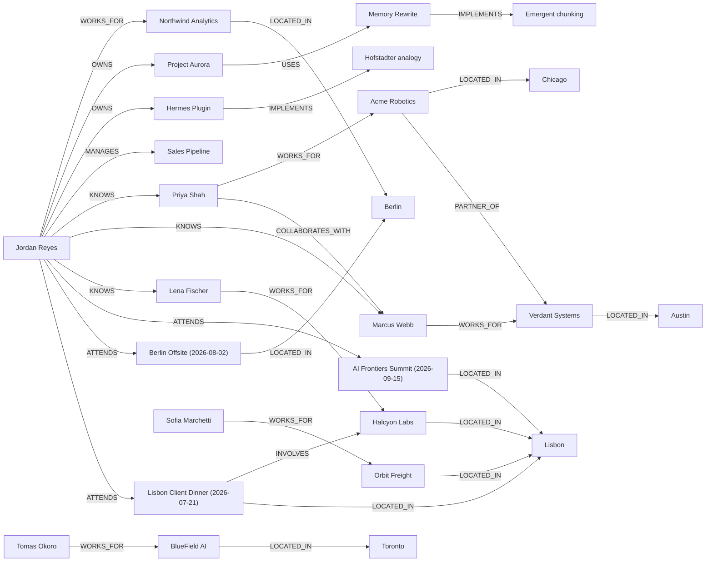

> **Example output (synthetic data).** This snapshot was generated by
> [`scripts/brain_viz.py`](../scripts/brain_viz.py) against a small, entirely
> fictional memory store (an indie AI developer's world, with no real people or
> companies) purely to show the shape of what the tool produces. The Mermaid
> map below renders directly on GitHub; the interactive `brain_graph.html`
> version is what the screenshot in the README shows. Generate your own with
> `brain_viz.py <output_dir>` against a populated `memory_store.db`.

# Hermes Brain, Memory Snapshot

*Snapshot taken 2026-07-03. This is a read-only picture of what the Hermes agent currently knows, its facts, its semantic memory, and the relationship graph it reasons over.*

## At a glance

| | count |
|---|---|
| Facts (structured memory) | 15 |
| Semantic vectors (recall) | 0 |
| Graph entities (nodes) | 39 |
| Graph relationships (edges) | 55 |

**Entity types:** company 18, person 6, location 5, project 4, event 3, idea 3

## The core graph

How the main entities connect (the sales prospects are omitted here for legibility, they cluster by city + vertical in the interactive graph below):

## Biggest hubs

| entity | connections |
|---|---|
| Sales Pipeline | 13 |
| Jordan Reyes | 10 |
| Berlin | 6 |
| Chicago | 5 |
| Lisbon | 4 |
| Priya Shah | 3 |
| Marcus Webb | 3 |
| Acme Robotics | 3 |
| Verdant Systems | 3 |
| Halcyon Labs | 3 |
| Memory Rewrite | 3 |
| Austin | 3 |
| Toronto | 3 |
| Lisbon Client Dinner (2026-07-21) | 3 |
| Lena Fischer | 2 |
| Northwind Analytics | 2 |
| BlueField AI | 2 |
| Orbit Freight | 2 |
| Project Aurora | 2 |
| Hermes Plugin | 2 |

## Relationship vocabulary

`LOCATED_IN`×21, `PROSPECT`×12, `WORKS_FOR`×6, `KNOWS`×3, `ATTENDS`×3, `IMPLEMENTS`×3, `OWNS`×2, `MANAGES`×1, `COLLABORATES_WITH`×1, `PARTNER_OF`×1, `USES`×1, `INVOLVES`×1

## A few things Hermes knows

- Jordan Reyes is building a hybrid memory layer for the Hermes agent.
- Usage-based forgetting demotes recalled-but-ignored facts, never deletes by age.
- Project Aurora is the internal codename for the memory rewrite.
- Emergent chunking compresses co-occurring facts without losing the originals.
- The Hermes Plugin implements a Hofstadter-style analogy slot.
- Priya Shah leads the robotics perception team at Acme Robotics.
- Northwind Analytics is based in Berlin and focuses on supply-chain data.
- Sales Pipeline currently tracks twelve qualified logistics prospects.

## Explore the full graph

Open **`brain_graph.html`** in a browser for the complete interactive map (39 entities, 55 relationships), zoom, drag, search. Raw data is in `brain_graph.json`.

---
*Generated by `scripts/brain_viz.py` from the unified memory store (`memory_store.db`). Nothing here is editable, it's a mirror.*